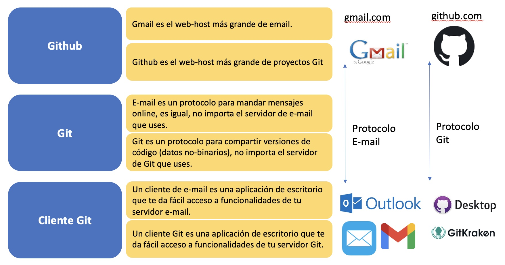

# Introducción a Python para las CCSS
## Sesión 0 : Cómo utilizar Github   [1](#myfootnote1)

<a name="myfootnote1">1</a> Este material se basa fuertemente en los entrenamientos de [DIME](https://github.com/worldbank/dime-github-trainings), del World Bank. Gracias por la licencia MIT!
(Y gracias a Alexander Quispe por el incentivo ahacer esta intro a github!)

### Antes de empezar, verifica tener lo siguiente:

1.  Cuenta en Github https://github.com/join (Bonus: cualquier email educativo @edu / @edu.pe permite obtener una cuenta pro https://github.com/education).
2. Mandar tu nombre de usuario a csolisu@pucp.edu.pe.
3. Tener instalado Github Desktop https://github.com/apps/desktop. 
4. Iniciar sesión en Github Desktop con tu cuenta creada. 
5. Recibir invitación del repo https://github.com/ccsuehara/letras_2025_0 y haber aceptado.
7. Tener un editor de texto instalado. 
7.1 En windows, puede ser notepad, en mac, el textedit   

### Cómo usar Github

Objetivos de aprendizaje:

Como observador: 

- Explorar un proyecto de Github y ver en qué contribuyen los otros miembros. 

Como contribuidor: 
- Personal
    - Crear mis propios repos para trabajar en mis proyectos. 
    - Realizar cambios y mejoras, y poder subir estos cambios. 

- Equipo: 
    - Descargar un repo de Github y poder trabajar con él. 
    - Crear un espacio en el repo del proyecto en el que tú puedas trabajar. 
- Realizar cambios y mejoras al proyecto, y poder subir esos cambios. 

## ¿Qué es Git y Github?

### Git 
Git es una herramienta muy utilizada en el mundo de la informática para gestionar código. Es especialmente buena para la colaboración, pero también resulta muy útil en proyectos de una sola persona. En los primeros tiempos de Git, uno tenía que gestionar su propio repositorio de código a través de la línea de comandos y configurar sus propios servidores para compartir el código, pero ahora existen varias soluciones basadas en la nube con interfaces no técnicas. GitHub es la más utilizada en la comunidad de investigación. Otras implementaciones de Git que se utilizan habitualmente son GitLab y Bitbucket. Dado que todas se basan en Git, comparten la mayoría de las funciones y, si aprende una de ellas, sus habilidades se pueden transferir a otra. 

### Github 
GitHub tiene herramientas que ofrecen alternativas menos técnicas a la hora de interactuar con la funcionalidad de Git y esa es probablemente la razón por la que GitHub es la implementación de Git más popular en la comunidad de investigación. El principal inconveniente de GitHub es que no se pueden crear repositorios de código privados utilizando la cuenta gratuita (pero se puede recibir una invitación). GitLab, por ejemplo, te permite crear repositorios privados en una cuenta gratuita, pero debes usar la línea de comandos para contribuir con el código. Hemos creado recursos y proporcionamos enlaces a recursos externos adicionales para GitHub en nuestra página Primeros pasos con GitHub.

[Source](https://dimewiki.worldbank.org/Data_Management)

Viéndolo esquemáticamente:

[Source](https://github.com/worldbank/DIME-Resources/blob/master/git-1-intro.pdf)

### ¿Qué es un contribuidor? 

>> Básicamente alguien que contribuye con código a un repositorio (repo). 
Entiende y sigue instrucciones del administrador del repo.

- Github contribuye a solucionar el problema del "Documento_Final.docx".

- E inclusive del "Documento_final_final_finalísimo.docx"

- Nuestra solución común es llamar al documento 
    - Paper_for_review_csu_200321.docx
    - Paper_for_review_csu_200321_ae_comments.docx

- Github trackea no solo las iniciales y la hora, sino cada edición hecha al documento. 

>> OJO: github no lee archivos binarios (o archivos que no sean puro texto).

- Github también soluciona: 
    - Problemas de copia conflictiva (Dropbox, etc)
    - No puedo reproducir los resultados de mi tesis
    - Quién escribió esto hace muchos años

Los conceptos que manejaremos hoy son 3:

## 0. Repositorio Git

Un repositorio es el elemento más básico de GitHub. Es un lugar donde puedes almacenar el código, los archivos y el historial de revisiones de cada archivo. Los repositorios pueden contar con múltiples colaboradores y pueden ser públicos como privados.

### Creando un repo

Usualmente, Github servirá para almacenar proyectos individuales. Crearemos un repo en el que podremos guardar nuestro proyecto final.

1. Ve a la página principal de Github. Dale click al botón verde que dice *New*

2. Luego, elige el nombre del repo. 
Tambien tenemos otras opciones, como agregar una descripción del repo, volverlo público/privado, agregarle un .gitignore, un README.md, y una licencia. Creen el repositorio!

3. Una vez creado el repo, te dan las siguientes instrucciones. Dale click a *Set up in Desktop*

4. Aparecerá el siguiente cuadro, acepten 

5. Finalmente,  github les pedirá que elijan la carpeta asociada al repo. **No elegir una carpeta que esté en Dropbox, Box, etc** !. 

### ¿Qué guardar en un repo?
Lo más recomendable es almacenar **solamente** archivos de código. Archivos de datos (bases de datos, pdfs, etc) idealmente deberían ir en otro folder.

## 1. Commit 

- ¿Qué es un control de versiones? 

Por ejemplo, miremos al control de versiones que tiene un google doc: 

Todas las versiones de este documento están almacenadas. Se pueden ver los cambios que hizo cada contribuidora al documento. Sin embargo, Google docs almacena la totalidad de todas las versiones!

Para no tener que guardar todas estas versiones, Git  **usa los commits para indicar las differencias significativas entre versión y versión**

Cada commit es una captura de los archivos del proyecto en determinado momento, y lo compara respecto al commit anterior. 

Cada commit tiene un timestamp (dentro de este ya tiene un id que incluye fecha y hora)

#### ¿Cómo hacer un commit ? 

0. Crear .txt llamado lyrics en mi nuevo repo y lo guardé. Abre el tab de cambios (changes) en Github Desktop. 
Github desktop se ha dado cuenta que hay nuevos cambios a tu repo.
1. Sigue los siguientes 3 pasos para hacer commit:  
    1. Asegúrate de que tus cambios estén marcados. 
    2. Escribe un mensaje de commit. 
    3. Haz click en el boton de sync. 

### Checkea tu commit en Github

Ve a https://github.com/nombredeusuario/nombrederepo/network
- Ves tu commit ? 

Ve a https://github.com/nombredeusuario/nombrederepo/commits

## 2. Clone (clonar)

Clonar es similar a descargar un repositorio. 
La diferencia entre clonar y descargar es que **Github recuerda de dónde descargamos el repositorio**. Esto es necesario para saber a dónde mandar nuestros cambios cuando seamos contribuidores. 

### Cómo clonar un repo
1. Ve a https://github.com/ccsuehara/python_para_las_ccss
2. Haz click en el botón verde que dice *Code*
3. Dale click en *Open with Github Desktop*
4. Selecciona la carpeta de tu computadora donde se clonará el repo. **NO** lo clones en una carpeta compartida de Dropbox, Box, etc. 

Finalmente, explora el folder clonado! Compáralo con lo que viste en Github. 

### Diferencias con un fork 

## Pull requests 

Una propiedad adicional a los branches es el **pull request**
Cuando las ediciones que hiciste están listas para ser mergeadas con el *main*, puedes hacer un pull request, lo cual integrará tus ediciones en la rama *main*. 

### OJO: por favor no aceptes tu mism@ el merge pull. Yo lo haré.

Es común que el acceso a la rama *main* solo la tenga el repo maintainer (no todos los contribuidores).

- Ve a https://github.com/ccsuehara/letras_2025_0/pulls y dale click a *New pull request*
- Asegúrate de que la branch *main* esté seleccionada como *base:* branch. 
- Selecciona tu branch como *compare:* branch
- Scrollea para ver que tus ediciones son las que quieres que se integren con la main branch, dale click a *Create pull request*

6. Listo, ya tienes un folder asociado a un repo en tu computadora. Intenta hacer tu primer commit y verifica que 

OJO: NO OLVIDEN DE HACER COMMIT CONSTANTEMENTE A SU TRABAJO   
OJO 2: NO OLVIDEN SINCRONIZAR DESPUES DE HACER COMMIT!

## Adicionales

##  4.Adicional: Branch 

- Los branches son la propiedad "killer"/genial de Git. Esto hace a Git una herramienta poderosa de colaboración y no solo de control de versiones.

- Los branches **permiten crear una copia del código donde puedes experimentar/jugar/desarrollar** con él. Si te gusta el resultado, **puedes mergear el experimento a la versión principal**.

- Esta versión no-lineal es más fidedigna a cómo se trabaja en la vida real. 

## Explorando branches

¿Puedes cambiar la rama en */commits*, qué sucede cuando cambias la rama allí ?

Cual es la versión clonada en tu computadora? Cuando se clona un repo **todas las versiones** son clonadas, pero **solo una** es la que se muestra en nuestra carpeta. 

Haz la prueba de cambiar la rama, en https://github.com/ccsuehara/letras_2024/, ¿cambia acaso el contenido? 

Un flujo de trabajo típico en Git implica tener varias ramas. Hay otras herramientas en Github que vuelve este flujo de trabajo muy manejable, sin embargo, está fuera del alcance de hoy. 

## Creando una branch

- Ve a https://github.com/ccsuehara/letras_2024, y dale click al botón que dice (símbolo branch) main. **Asegúrate que sea el main!!!**

- Escribe tu nombre "nombre_apellido" en el cuadro de diálogo y dale click para crear la branch. 

## Combinando el commit y el branch 

### ¡Ahora quiero que colabores en el repo de la clase!

1. Asegúrate de que tu rama aparezca en GitHub Desktop. Sitúate en ella. Esto significa que esta rama está checkeada (checked out).

2. Abre un editor de texto. 
3. Googlea la letra de tu canción favorita y cópiala en el editor de texto que acabas de abrir.  
4. Guarda el archivo en formato *.txt* con el nombre tunombre_cancion. 

   
## Otros recursos de aprendizaje: 

### Aprender Github desde el command line/ línea de comandos: 

- En este tutorial, hemos visto los elementos esenciales para utilizar Github, sin embargo, hay una forma de usar Github desde la consola. Aquí hay una lista de referencias en caso quieran explorar más este uso. 

https://education.github.com/git-cheat-sheet-education.pdf

