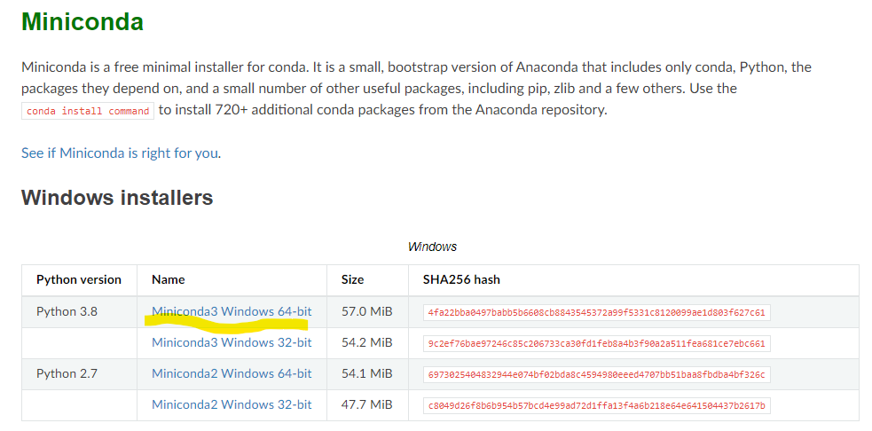
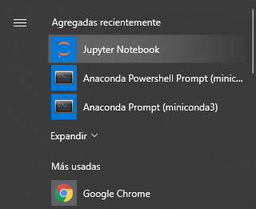
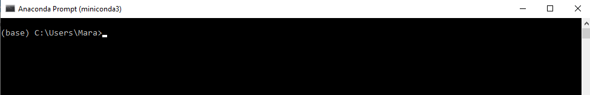
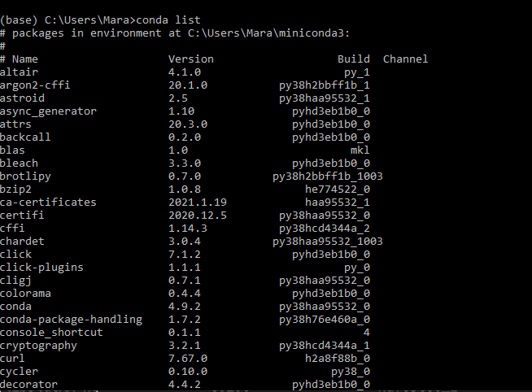
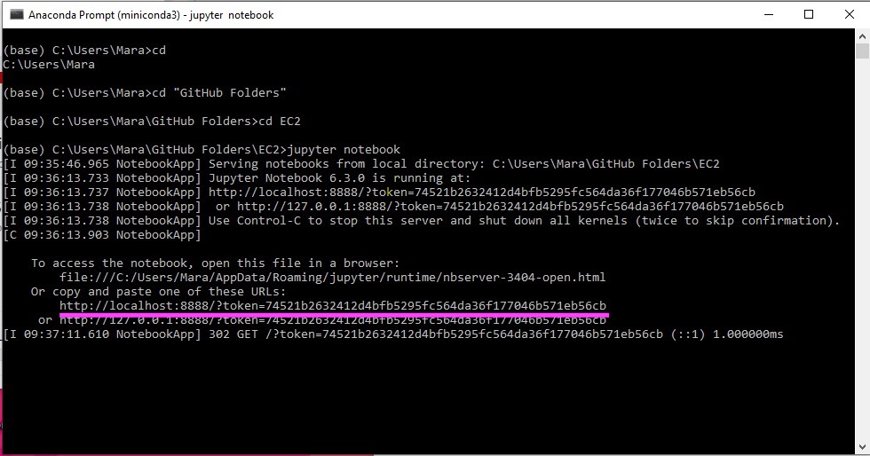
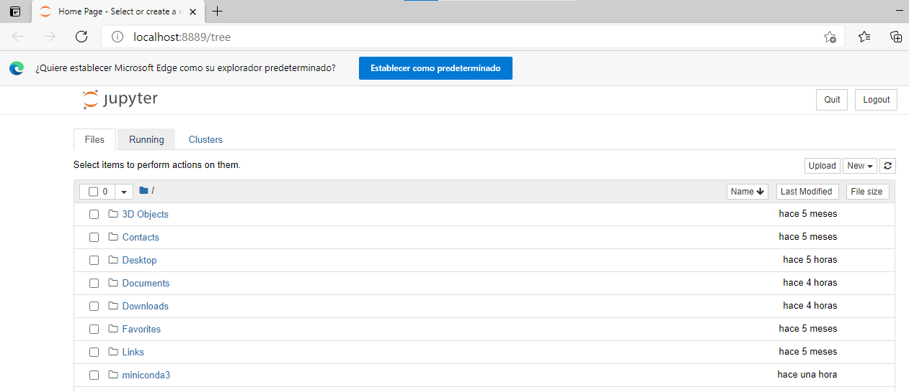
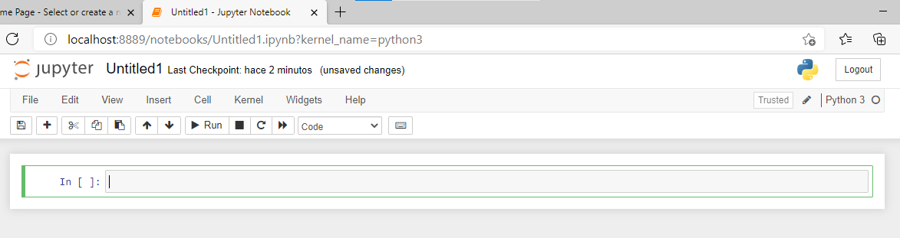

# Cómo instalar python

En esta sesión veremos cómo instalar python.

 Hay muchas formas de obtener Python.
 
(Por ejemplo no es como Stata en el que conseguimos el instalador y ya está instalado todo!).  

Vamos a simplificar el proceso al usar **miniconda**. 

Miniconda es a la vez un package manager y un environment manager. 

Package manager es una colección de herramientas que nos permite automatizar la instalación, configuración, actualización y desinstalación de programas de manera consistente(Wikipedia). En el día a día necesitaremos muchos paquetes externos cuya instalación puede generar conflicto con otros paquetes externos, o entre diferentes versiones. Conda nos solucionará ese problema!

Environment manager, o administrador de entornos, es una herramienta que permite la creación de entornos, que aislan los paquetes externos y versión de python usadas exclusivamente en ese entorno.  
Ahora no necesitamos saber mucho sobre entornos, primero aprenderemos python y luego podemos hablar de cómo manejar entornos.

Usaremos miniconda porque tiene los componentes mínimamente suficientes para trabajar en python. 

a. Ya tienes anaconda? 
- En caso ya tengas anaconda, actualiza la versión utilizada.  

b. Quieres reemplazar anaconda por miniconda?
- Sigue las instrucciones de desinstalación de https://docs.anaconda.com/anaconda/install/uninstall/ 

### A instalar miniconda!
Descarga el instalador de https://docs.conda.io/en/latest/miniconda.html

- Selecciona este instalador. **Tiene que ser Python 3.8** (En caso tengas mac, descarga el similar en Mac).



- Abre el instalador. Saldrá una opción ,selecciona la opción de *Install for just me*


- Luego el instalador preguntará dónde quieres almacenar el programa instalado. Está bien el siguiente default: C:\Users\<usuario>\miniconda3

- Luego, saldrán 2 opciones avanzadas. Por conveniencia, selecciona  *Register Anaconda as my default Python 3.x*


## Listo! Ya tenemos miniconda instalado. 
Esto también implica la instalación de python, así como otros paquetes adicionales (pero no todos los necesarios aún).

Para verificar que la instalación fue bien, ve al ícono de windows en la esquina inferior izquierda. Al desplegar el menú, verás el programa del Anaconda Prompt. Ábrelo. 

  

* Abre el Anaconda Prompt (miniconda 3).

Al abrir el programa, vemos una pantalla así. 


Nota que en paréntesis está la palabra ``` (base) ```. Esto indica que el entorno (environment) en el que nos encontramos es el base. 

Podemos manejar los environments en los que trabajamos, y cambiarlos a nuestra conveniencia. Para esta clase solo trabajaremos en ``` (base) ```

- Queremos ver qué packages están disponibles en el entorno.

Para ello, tipea el comando 
```
conda list

```

Sale una lista larga entre los cuales está incluido python. 




## Cómo agregamos paquetes nuevos??

A continuación descargaremos los paquetes que utilizaremos en esta clase. Si se fijan, aún no están incluidos en el ```conda list ```. 

Estos serán numpy, pandas, altair, y finalmente, los jupyter notebooks.  

OJO: Cuando creen un environment nuevo, es importante instalar de una todos los paquetes necesarios para no crear conflictos de dependencia. 


En nuestro entorno ``` (base) ``` tipearemos lo siguiente

``` 
conda install numpy pandas jupyter altair

 ```

Listo! Ya tenemos todos los paquetes que necesitamos. 

## Y ahora cómo abro python?

1.  Abre una ventana del anaconda prompt. Asegúrate de que diga ``` (base) ```
2.  Tipea ``` cd path```, siendo el path, en el caso de la imagen siguiente, ```C:\Users\Mara\GitHub Folders\EC2 ``` , es decir en mi caso yo tipeé ``` cd C:\Users\Mara\GitHub Folders\EC2```. 




- El comando ``` cd``` significa cambiar directorio (change directory). Noten que el ```cd``` puede utilizarse progresivamente (carpeta por carpeta), pues primero fui a Github Folders y luego a EC2. Al final de este README colocaré un cuadro con otros comandos útiles. 

---
**CONSEJO**: traten de llamar a sus directorios sin espacios, en este caso, Github_Folders en vez de Github Folders, ya que los encuentra más rapido.   
**CONSEJO 2**: si te equivocaste de carpeta, siempre puedes regresar al lugar original colocando ```cd``` sin ningún path adicional. 

---

3. Una vez te sitúes en el directorio en el que quieres trabajar, tipea ``` jupyter notebook ```
4. Una ventana en el navegador se abrirá. 



5. En la esquina superior derecha, dale click a ``` New - Python 3 ```



Listo! Ya abrimos nuestro Jupyter notebook :) , ya podemos empezar a escribir código!

---
**ADVERTENCIA!** **recuerden no cerrar el Anaconda prompt** en donde tienen la sesión de JN corriendo, ya que esto cerrará el trabajo que están avanzando.

---

---
### Qué hacer si cerramos nuestro JN de casualidad de nuestro navegador? 

Para poder abrir de nuevo el JN, aparecerá una URL similar a la resaltada en rosado en el ejemplo de arriba en el command prompt. Tan sólo copien el URL señalado en rosado que les aparecerá en su ventana una vez abierto el JN, y listo, pueden proceder con su trabajo. 

---

---
### Otros comandos útiles
Hasta ahora hemos usado el comando ```cd``` dentro del anaconda prompt para dirigirnos a nuestro directorio(folder/carpeta) de interés.  Aquí detallo unos cuantos comandos adicionales que ayudarán a navegar por los directorios eficientemente. 

``` cd .. ``` (noten los 2 puntos) sirve para ir al parent directory (o el directorio que contiene a nuestro actual directorio). Por ejemplo, en  ```C:\Users\Mara\GitHub Folders\EC2```, GitHub Folders es el parent directory de EC2.   
```dir ``` sirve para listar todos los directorios y archivos dentro del directorio en el que nos encontramos.   
``` echo %cd% ``` sirve para ver el actual path en el que nos encontramos. 

---

